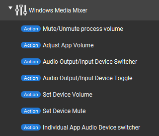
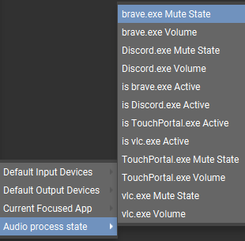
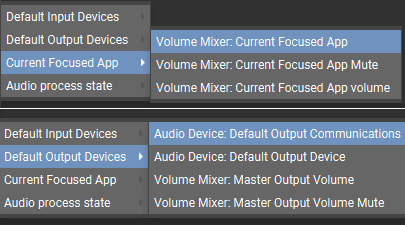

# TouchPortal-Windows-MediaMixer
a TouchPortal plugin that allows you to control Window's default audio mixer.

- [TouchPortal-Windows-MediaMixer](#touchportal-windows-mediamixer)
- [Change Log](#change-log)
- [What is this?](#what-is-this)
- [Functionality](#functionality)
    - [Actions](#actions)
    - [States](#states)
    - [Sliders](#sliders)
- [Versioning](#versioning)
- [Lincense](#license)
- [Bugs/Echancements](#bugsenhancements)

# Change Log
```

v2.0.0 - Major Updates to Audio Management and User Interaction & Performance
    New:
        - Added options to set, increase, and decrease the volume for audio devices.
        - Added `SetDeviceMute` function to control individual device mute states.
        - Introduced onHold capability for `SetDeviceVolume`.
        - Implemented bidirectional sliders for all input/output devices.
        - Added a new `WindowFocusListener` class to handle window focus events and update  accordingly.     (No more polling with `pygetwindow`)
        - Enhanced `audioManager.py` with new methods to manage default input/output devices and        focused app mute states more effectively.

    Improvements:

        - Plugin is now purely event-based (no more polling).
        - Removed the unnecessary `stateUpdate` function to reduce CPU/memory usage.
        - Added try/except/finally blocks to ensure proper cleanup and avoid redundant calls.
        - Improved error prevention and stability with additional try/except/finally blocks and         exception handling for various functions.
        - Refactored code to separate concerns into distinct files and classes for better       maintainability.
        - Removed obsolete imports and functions to streamline the codebase.
        - Enhanced integration with `TPClient` and registered callbacks for default device changes  and  volume/mute adjustments.
        - Added functions to fetch devices and initialize default devices upon startup.

v1.5.1 - Fixed listId not updating correctly
    Bug Fixes:
        - Fixed listId not updating correctly
        - Changed from "Change device volume" to "Set device volume" to make it more clear.

v1.5.0 - Fixed id and added ability to change audio volume
    new:
        - Added a new action allows user to change their mic or speaker volume
        - Fixed current app volume id is "text" changed to proper id format

v1.4.0 - get current focused app volume
    New:
        - Added get current focused app volume


v1.3.1 - Bug fixes on behavior on audio source changing action
    Bug Fixes:
        - Fixed where if you have 2 same action in button editing when u select either Output/Input it'll reset the previous action.


v1.3.0 - Allow string state use as volume and get current master volume as state
    New:
        - Added ability to get current master volume as a state.

    Bug Fixes:
        - Fixed that you cannot insert a state to be used as volume in actions


v1.2.0 - Individual app audio routing & added device stateback.
    New:
        - Individual app routing meaning you can send app's audio source to any audio devices you wish.
        - Added Ability to show current input/output Default and Communcation device state back.
        - Updated the python sdk to V1.7.9
    Bug Fixes:
        - Memory Leak is fixed.


v1.1.1 - CPU & RAM leak (6/5/2022)
    Fixed:
        - CPU and RAM Leak
        "In order to fix this leak I had to remove show current default in/output device states.
        will find other way to solve this. as for now it's completely disabled.


v1.1.0 - Device Output & bug fixes (5/29/2022)
    Whats added?
        - Action
            - Volume Mixer: Change Default Audio Devices
        - State
            - Audio Device: Get default Output devices
            - Audio Device: Get default Output commication devices
            - Audio Device: Get default input device
            - Audio Device: Get default input commucation device
    Bug fixes:
        - Plugin does not delete expired application state
    
    Known error:
        to my experice plugin randomly crashes (currently debugging this)


v1.0.0 - InitialRelease (5/26/2022)
   Features:
      - Mute/Unmute/Toggle per application
      - Increase/Decrease/Set Master vol, current focused app or app you choose.
      - Using slider to control each application's volume

```

# What is this?
Have you ever wondering if theres a way to easily control Windows Volume Mixer without using third party software like voicemeter? You found the right place! Because this uses Windows buildin API which allows you to change individual Application volume in tip of finger!

# Functionality

## Actions


- Audio Output/Input Device Switcher
    - This allows you to change global default or communication audio device.
- Audio Output/Input Device Toggle
    - This allows you to toggle the default global audio or communication device between two choices.
- Set Device Volume
    - This allows your Input & Output devices volume.
- Set Device Mute
    - This allows your Input & Output devices mute.
- Mute/Unmute process volume
    - This allows you to Toggle/Mute/Unmute any program you pick.
- Adjust App Volume
    - It allows you to Increase/Decrease/Set any application Volume
- Individual App Audio Device switcher
    - This allows you to change app's volume source to a different audio device.

## States



- is appname.exe Active
    - This gives `True` or `False` It will show `True` if application is playing sound
- appname.exe Mute state
   - This gives `Muted` or `Un-muted` depends on application
- appname.exe Volume
    - This gives the applications volume `0-100`

- Audio Device: Default Output Device
    - Displays current Default output device
- Audio Device: Default Output Communication Device
    - Displays current Default output communication device
- Audio Device: Default Input Device
    - This shows your default input device
- Audio Device: Default Input Communication Device
    - This shows your default input communication device

- Volume Mixer: Get Current Master Volume
    - Displays current master output volume via states ranging from `0-100`
- Volume Mixer: Get Current Master Input Volume
    - Displays current master input volume via states ranging from `0-100`
- Volume Mixer: Current Focused App
    - This gives you current focused app's name
- Volume Mixer: Focused App Volume
    - Displays current focused app volume as a state ranging from `0-100`
- Volume Mixer: Focused App Mute
    - Displays current focused app Mute as a state, `Muted` or `Un-muted`

### Sliders

This plugin also includes slider functionality. to use this feature simply change button type to `Slider` then you will have

- Volume Mixer: APP Volume slider
    - when button type is slider, you have ability to change selected app volume
     using slider also includes Current app (controls volume on whatever is on focus) and control master volume too! 
- Volume Mixer: Default Audio Device Slider
    - Adjust the volume of your default input/output devices using sliders.

# Versioning

We use [SemVer](http://semver.org/) for versioning. For the versions available, see the Releases section

# License

This project uses [GNU GPL v3.0](LICENSE)

# Bugs/Enhancements
Use the Github Issues tab to report any bugs/enhancements for this plug-in. Or mention them in the Official Touch Portal discord channel #win-mediamixer
